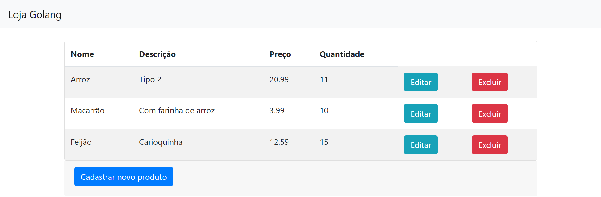

# Loja com Golang

Este é um projeto de uma aplicação Web em Go para uma loja virtual simples, utilizando MySQL como banco de dados e HTML com Bootstrap para as interfaces.

## Funcionalidades

- Listar produtos
- Adicionar novo produto
- Editar produto existente
- Excluir produto

## Tecnologias Utilizadas

- Go
- MySQL
- HTML
- Bootstrap

## Pré-requisitos

- [Go](https://golang.org/doc/install) instalado
- [MySQL](https://dev.mysql.com/downloads/mysql/) instalado e configurado

## Configuração do Banco de Dados (MySQL)

Para configurar o banco de dados, você precisará criar o database `db_loja_golang` e a tabela `tbl_produtos` utilizando os seguintes comandos SQL dentro do MySQL:

### Criação do Database

```sql
CREATE DATABASE db_loja_golang;
```

### Acesso ao Database criado

```sql
USE db_loja_golang;
```

### Criação da Tabela

```sql
CREATE TABLE tbl_produtos (
    id INT PRIMARY KEY AUTO_INCREMENT,
    nome VARCHAR(100),
    descricao VARCHAR(255),
    preco DOUBLE,
    quantidade INT
);
```

## Como executar

1. Clone o repositório:

    ```bash
    git clone https://github.com/pedrolessa-dev/loja-golang.git
    ```

2. Instale as dependências:

    ```bash
    go mod tidy
    ```

3. Configure as variáveis de ambiente para a conexão com o banco de dados MySQL:

    ```bash
    export MYSQL_USER=seu_usuario_mysql
    export MYSQL_PASSWORD=sua_senha_mysql
    ```

4. Volte na aplicação e execute ela:

    ```bash
    go run main.go
    ```

5. Acesse a aplicação atraves do seu navegador no seguinte endereço: **<http://localhost:8000>**.

## Imagem da aplicação



## Estrutura do Projeto

- `main.go`: Arquivo principal que inicia a aplicação e carrega as rotas.
- `routes/routes.go`: Define as rotas da aplicação.
- `controllers/produtos.go`: Contém as funções que controlam o fluxo da aplicação.
- `models/produtos.go`: Define a estrutura dos dados e contém as funções relacionadas ao banco de dados.
- `db/db.go`: Arquivo responsável por estabelecer a conexão com o banco de dados.
